# Duckling (codename)

Working title: **Cygnet**. A cozy 3D exploration game about raising a "duckling" from egg to adulthood, in which the world shrinks as you grow and regains its color as you find where you belong.

## Status

Pre-production. Engine decided: Godot 4.7.2 with GDScript. Solo developer, PC only (Steam / itch.io). Target length 2–3 hours.

## Documents

| Document | Purpose |
|---|---|
| [docs/design/cygnet-design-doc-v0.1.md](docs/design/cygnet-design-doc-v0.1.md) | Full design vision plus the v1 scope plan, prototype milestones, and 10-week learning path |

## Layout

- `docs/design/` — design documents, versioned by filename.
- `game/` — the Godot 4 project. See [game/README.md](game/README.md) for controls, layout, and the smoke tests.
- `game/assets/nature_kit/` — Stylized Nature MegaKit (standard, free version) by Quaternius, CC0. Trees, grass, rocks, flowers, pebbles.

## Screenshots (Home Pond with the Stylized Nature MegaKit, software-rendered)

| Spawn at the nest | Paddling as a hatchling | Same pond at juvenile scale |
|---|---|---|
| 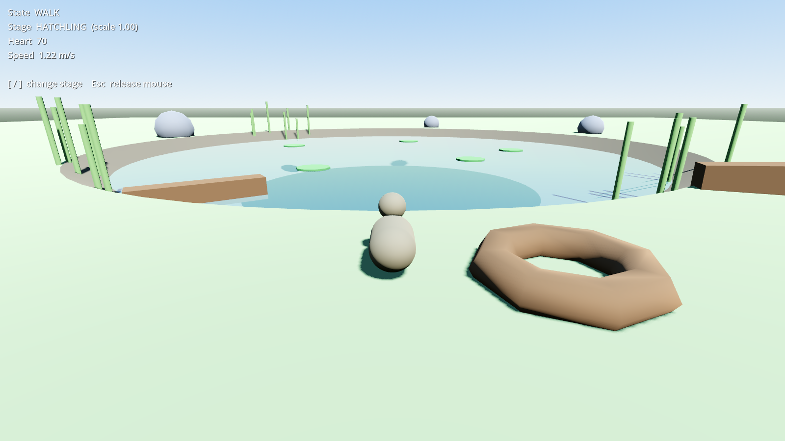 | 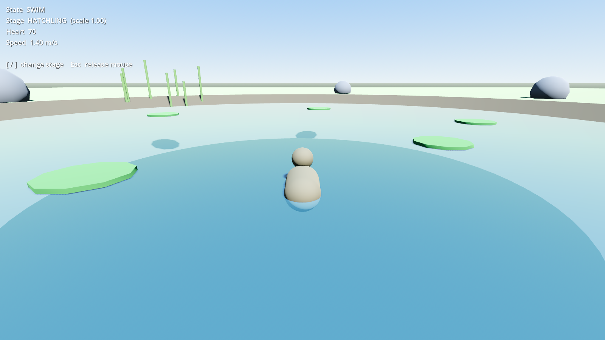 | 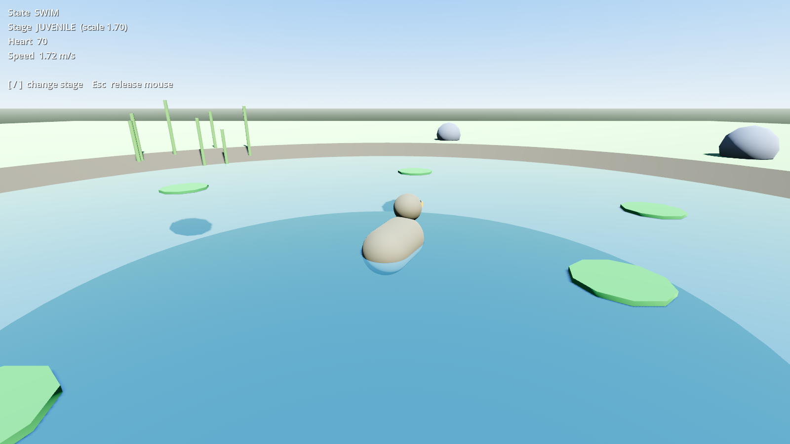 |

## Screenshots (P5 vertical slice: the egg prologue)

| Inside the egg, seven pecks in | The pop | Hatched beside the siblings |
|---|---|---|
| 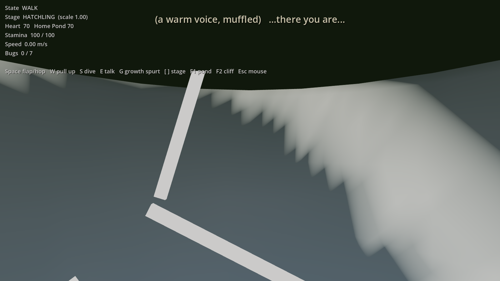 | 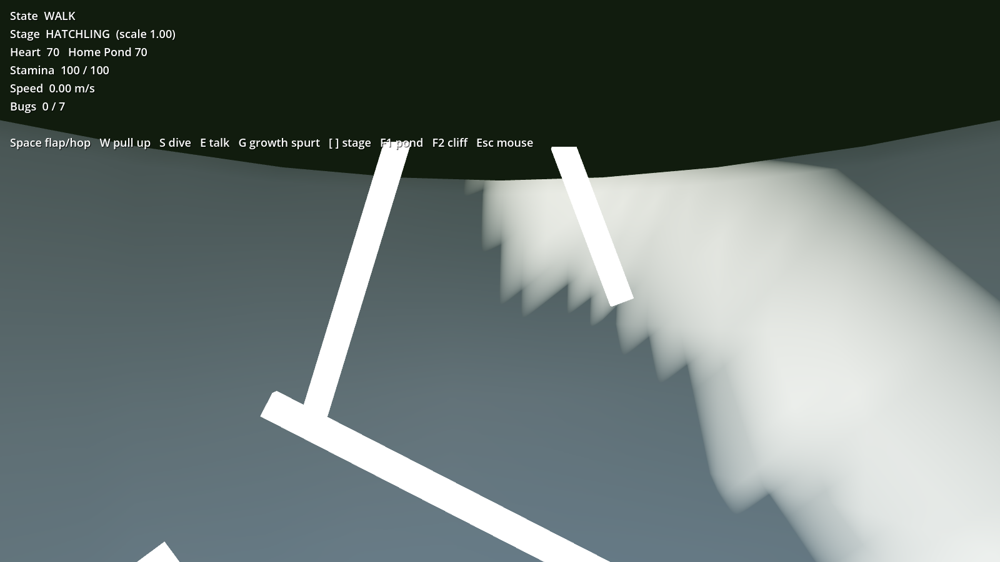 | 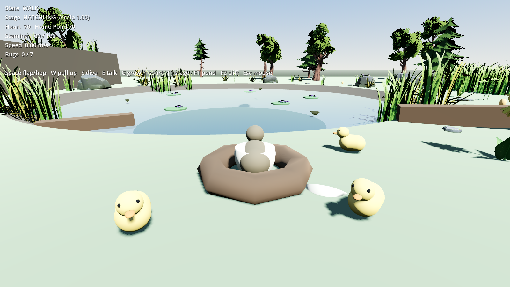 |

## Screenshots (P2 growth spurt)

| Hatchling by the nest | World shrinking mid-spurt | Duckling afterward |
|---|---|---|
| 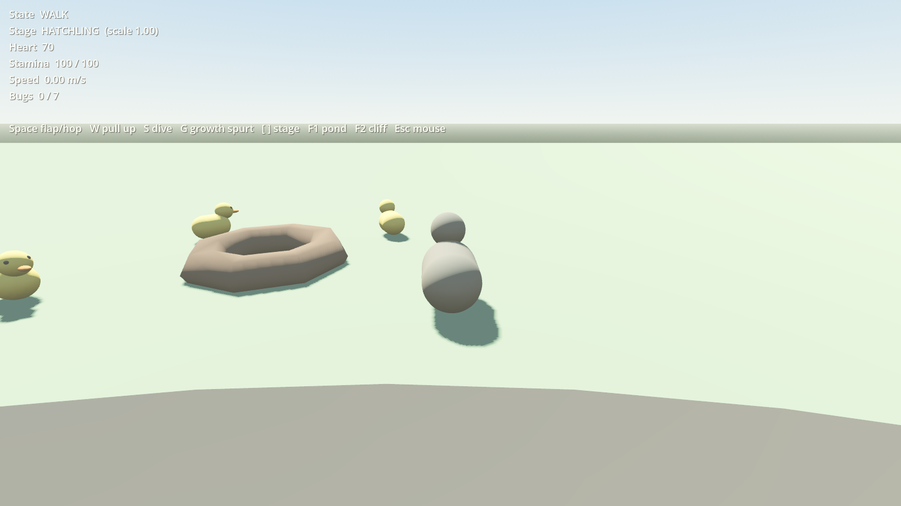 | 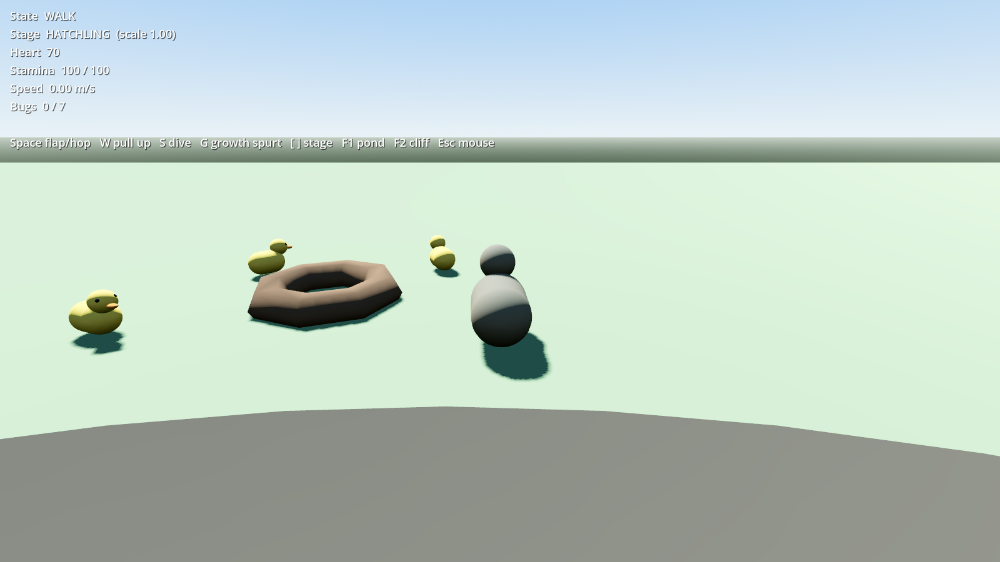 | 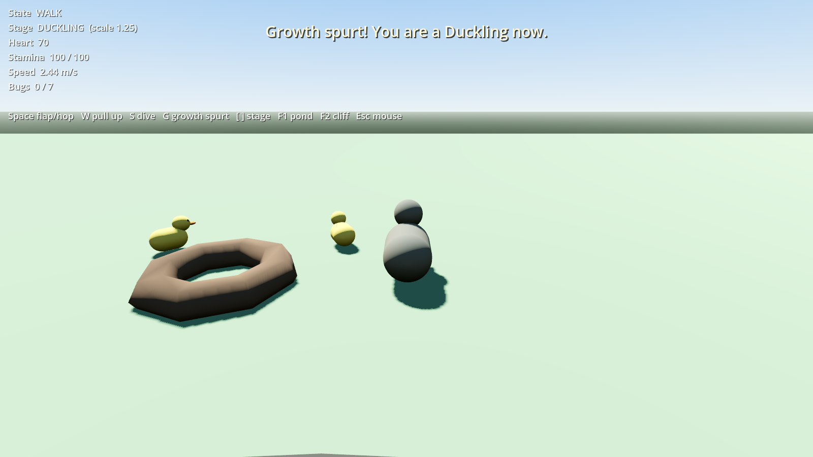 |

## Screenshots (P3 heart)

| Heart 70 at the start | Heart 10 after the culvert | Meeting Nib | Heart 100 after Nib's Pantry |
|---|---|---|---|
| 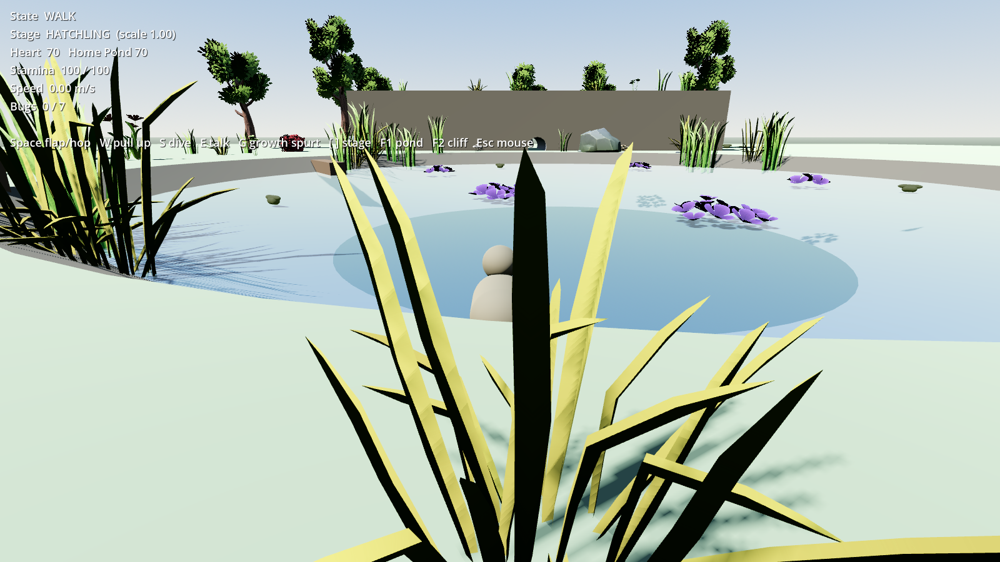 | 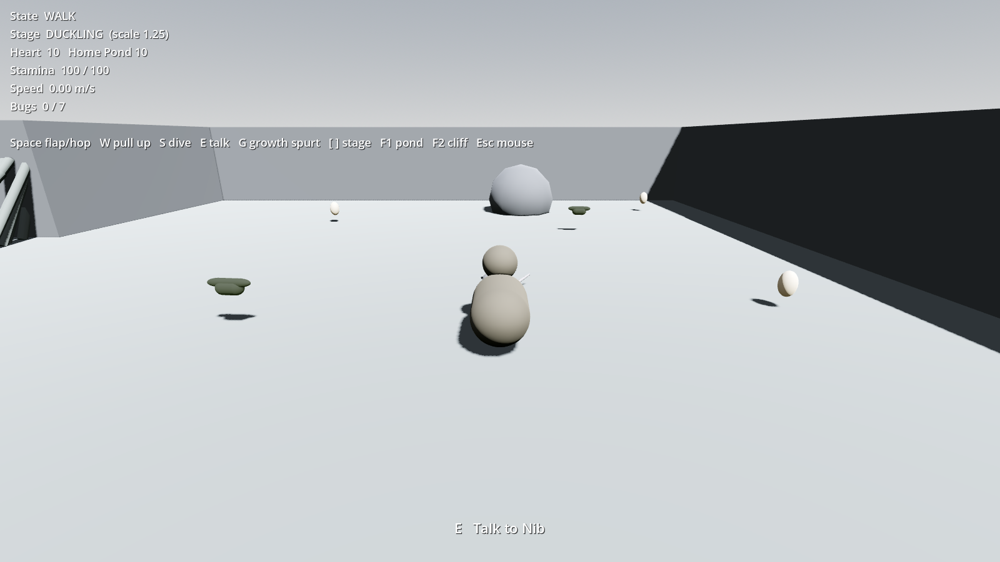 | 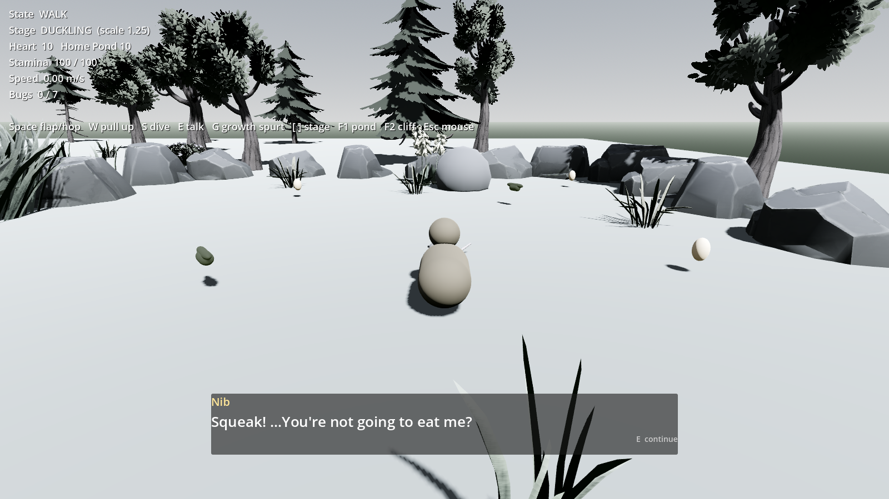 | 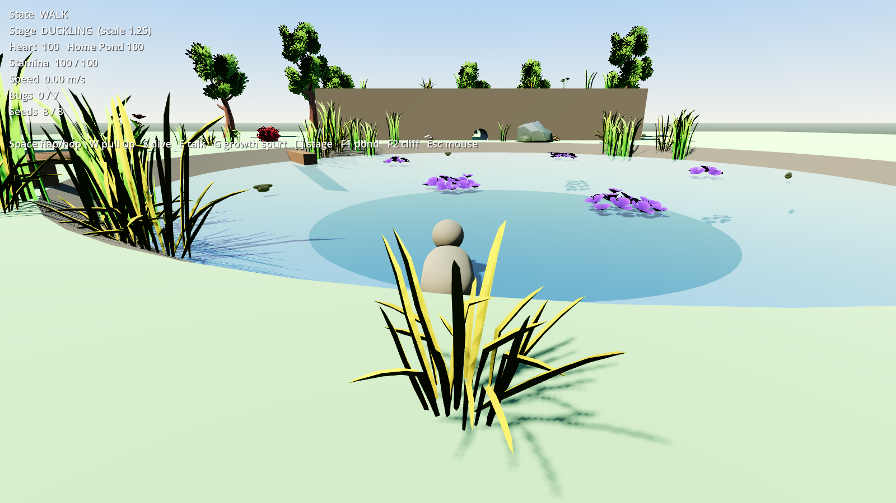 |

## Screenshots (P4 flight course)

| Gliding off the ledge | Dive | Pull-up |
|---|---|---|
| 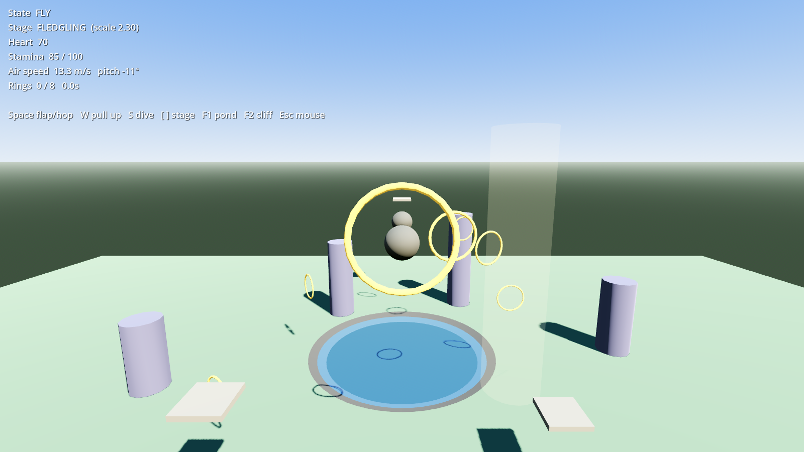 | 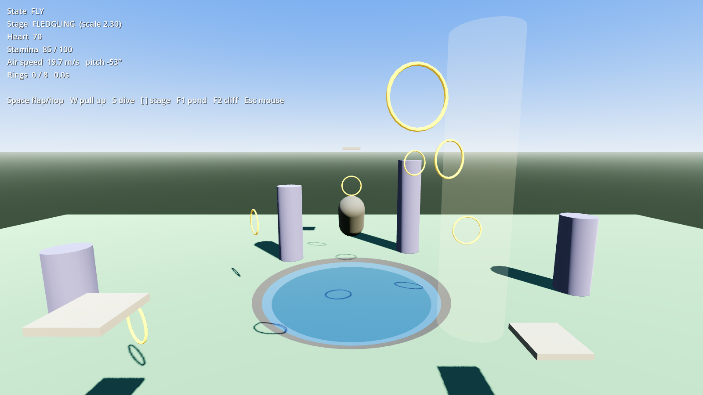 | 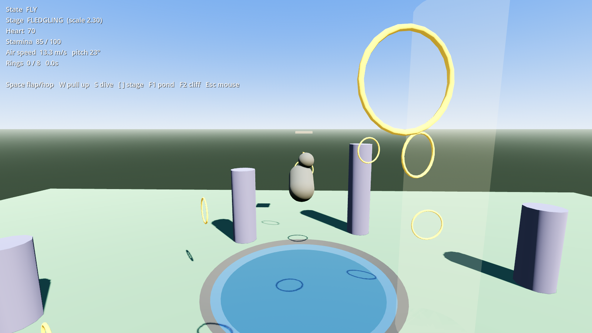 |

## Progress

| Milestone | Status |
|---|---|
| P1 — Duckling (grey-box pond, walk / swim / hop, camera) | Skeleton in place; needs hands-on feel tuning |
| P2 — Growth | Growth Spurt cutscene (world shrinks around you), reed wall you grow into, culvert you grow out of, bug collection triggers spurt 1 |
| P3 — Heart | Region sub-hearts drive material saturation; global Heart drives sky, sun, post-process. Siblings leave through the culvert (Heart 10), meeting Nib and Nib's Pantry restore it to 100 |
| P4 — Flight | Cliff test course in place: flap, glide, dive, pull-up, thermals, ring course, water and ledge landings. Needs hands-on feel tuning |
| P5 — Vertical slice | Egg prologue done (first person, peck to crack, pull-out reveal). Act 1 family, hawk shadow, and playtest to come |
